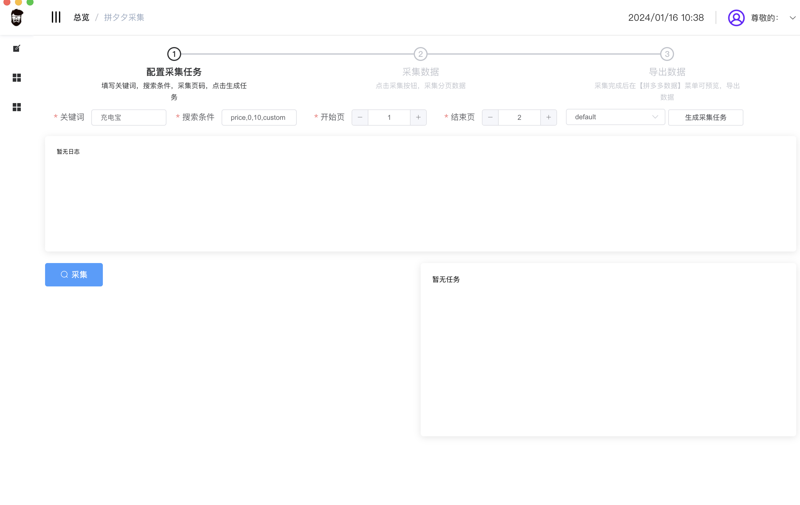

### 拼多多数据采集器

> 技术栈：nodejs;vue;electron

 **支持 windoes，mac 操作系统** 

#### v1.0版即将上线
- 关键词+筛选条件  采集 商品数据
- 店铺内 条件筛选  采集 商品数据
- 导出Excel

#### 系统截图



敬请期待！
合作&定制请联系：
QQ:1193447180  微信：DP6683007


### To run a project, you need to have **node version 16** or higher and **use yarn as your dependency management tool**

<p align="center">
  <a href="https://github.com/umbrella22/electron-vue-template">
    
  </a>
</p>

<h3 align="center">Thanks for support.</h3>

<p align="center">
  <a href="https://www.jetbrains.com/?from=electron-vue-template" target="_blank">
    
  </a>
</p>


#### Build Setup

``` bash
# install dependencies
yarn or yarn install

# serve with hot reload at localhost:9080
yarn dev

# build electron application for production
yarn build


```
---
# Function list

- Auto update
- Incremental update
- Loading animation before startup
- i18n
- Incremental update (wait for test)

# Built-in

- [vue-router](https://router.vuejs.org)
- [vuex](https://vuex.vuejs.org)
- [electron](http://www.electronjs.org/docs)
- electron-updater
- typescript
- [element-plus](https://element.eleme.cn/#/en-US)
[electron-vue-template/中文文档地址](https://github.com/umbrella22/electron-vue-template/blob/master/README_ZH.md)
[electron-vue-template-doc中文在线文档](https://umbrella22.github.io/electron-vue-template-doc/)